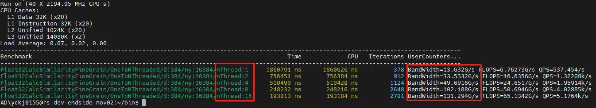
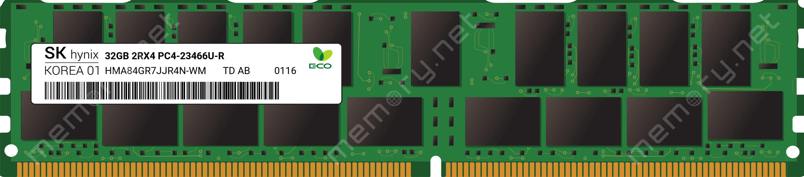
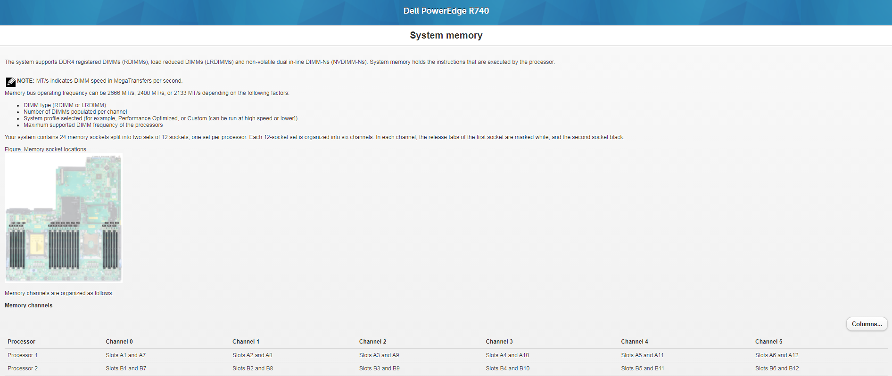
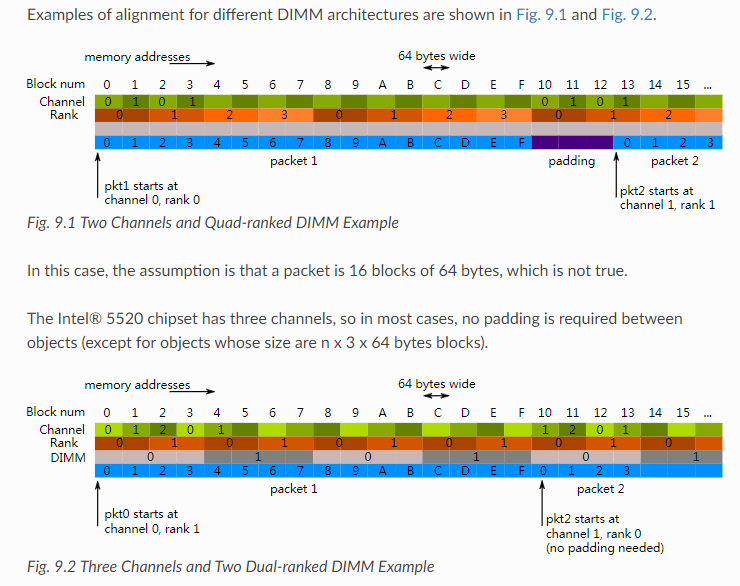

# Dell R740 服务器上的DRAM理论带宽计算与实践验证

---

## 实验结果
- 按照理论分析在4MiB的连续虚拟地址空间进行多线程计算1：N。 可以看到在线程数1-8的增加过程中内存带宽线性增长，16线程时达到理论带宽峰值的85%。16线程未达到很高的峰值原因应该是首先有一部分bank冲突另外还有一部分rank切换的额外开销。
- 随机向量比对，即每条特征向量在内存中的位置是随机的。目前还没有很好的处理方法，在测试机上可以达到50GB / S, 即理论带宽峰值的32%。

### CPU型号为至强® 银牌 4210 处理器
- 代号 Cascade Lake
- 最大内存速度 DDR4 2400MHz
- 最大内存通道数为 6
- 单通道最大带宽 2400MHz * 8byte = 19.2 GB / S
- 单socket最大带宽 2400MHz * 8byte * 6 = 115.19 GB / S
- 系统最大带宽 2400MHz * 8byte * 6 * 2 = 230.39 GB / S

### 实机 DIMM 信息：
-  SK Hynix 1x 32GB DDR4-2933 RDIMM PC4-23466U-R Dual Rank x4 Module
- 2R由两个Rank组成
- x4每个DRAM（芯片）的数据总线宽度，DDR*内存总线宽度为64位宽，64 / 4 = 16 个内存颗粒 / rank
- Ranks：64-bit arrays that share the bus
- 插在A1、A2、A4、A5、B1、B2、B4、B5
- 所以组的是每个 socket 4 channel 2 Rank
- 所以实机每个CPU的 MemPeak 是 2400MHz * 8byte * 4 = 76.8GB / S
- 实际系统最大内存带宽是2400MHz * 8byte * 4 * 2 = 153.6GB / S

### 验证
- 
- 计算代码单核L1Cache命中情况下带宽85GB / S，计算效率为CPU理论峰值的50%
- DIMM的每个rank有16个dram chip
- 每个dram chip有16个bank
- 每个bank有1KB的pagesize，所谓的“open page”
- 所以DRAM的总的open page size是8DIMM * 2Rank * 16DRAM chips * 16bank * 1KiB / bank = 4MiB
- 系统的pagesize为4KB，通过哈希页表映射
- 假设一段连续虚拟内存的哈希映射到对应的bank是均匀分布的
- 那么多个线程同时访问4MiB的连续虚拟空间的rowbuffer切换的冲突就是有限的

### 着重注意事项
- How To Befriend NUMA - OpenMP
- Is there NUMA next-touch policy in modern Linux
- 单socket最大带宽是UPI加本地带宽

